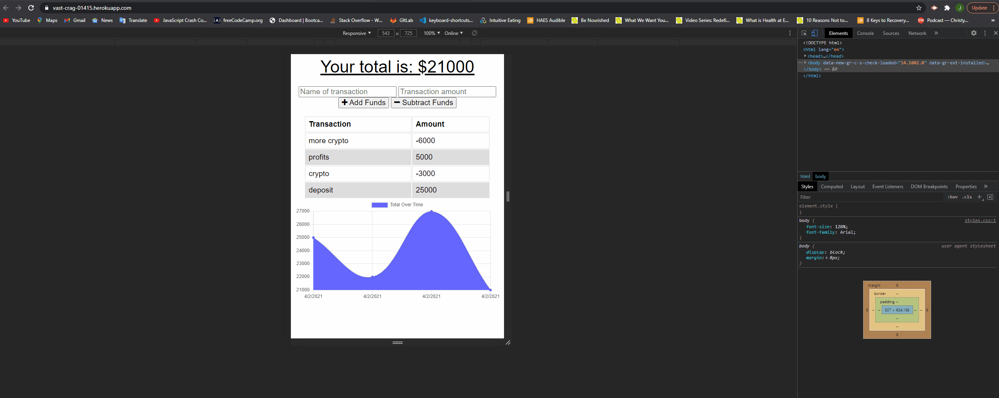

# online-offline-budget-app
The user will be able to add expenses and deposits to their budget with or without a connection. When entering transactions offline, they should populate the total when brought back online.

## Table of contents
- [General Info](#general-info)
- [Deployed App](#deployed)
- [Link to GitHub Repo](#link-to-github-repo)
- [Demo](#demo)
- [Technologies](#technologies)
- [Summary](#summary)
- [Author](#author)

## General Info

Offline Functionality:

  * Enter deposits offline

  * Enter expenses offline

When brought back online:

  * Offline entries should be added to tracker.

## Deployed App
- https://vast-crag-01415.herokuapp.com/

## Link to GitHub Repo
- https://github.com/joshrehanek/online-offline-budget-app

## Demo
- 

## Technologies
- [node.js](https://nodejs.org/en//)
- [npm](https://www.npmjs.com/)
- [mongoose](https://mongoosejs.com/docs/)
- [express](https://expressjs.com/)
- [morgan](https://www.npmjs.com/package/morgan)
- [compression](https://www.npmjs.com/package/compression)
- [lite-server](https://www.npmjs.com/package/lite-server)

## Summary

- The user will be able to add expenses and deposits to their budget with or without a connection. When entering transactions offline, they should populate the total when brought back online.

## Author
- Joshua Azzam Rehanek
